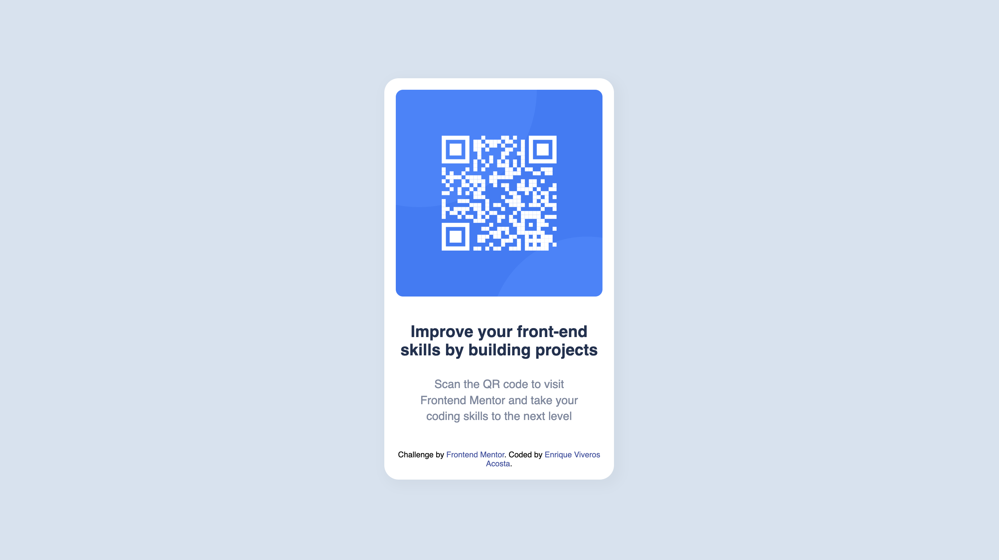

# Frontend Mentor - QR code component solution

This is a solution to the [QR code component challenge on Frontend Mentor](https://www.frontendmentor.io/challenges/qr-code-component-iux_sIO_H). Frontend Mentor challenges help you improve your coding skills by building realistic projects. 

## Table of contents

- [Overview](#overview)
  - [Screenshot](#screenshot)
  - [Links](#links)
- [My process](#my-process)
  - [Built with](#built-with)
  - [What I learned](#what-i-learned)
  - [Continued development](#continued-development)
- [Author](#author)


**Note: Delete this note and update the table of contents based on what sections you keep.**

## Overview

### Screenshot





### Links

- Solution URL: [Github Solution Repo](https://github.com/eriglesias/qr_code_frontend)
- Live Site URL: [Vercel live site URL here](https://qr-code-frontend-pearl.vercel.app/)

## My process

### Built with


- CSS custom properties
- Flexbox
- HTML 


### What I learned


```html
<h1>Some HTML code I'm proud of</h1>
<p> I can better group elements within a website</p>
```
```css
body {
    font-family: 'Outfit', sans-serif;
    display: flex;
    justify-content: center;
    align-items: center;
    width: 100%;
    height: 100vh;
    background-color: var(--light_gray);
}
```


### Continued development

- Grid mastery
- Flexbox mastery
- resposiveness for several screen sizes 
- better choosing of div containers and classes agroupation 


## Author

- Website - [Enrique Viveros Acosta ](https://erkike.com/)
- Frontend Mentor - [@eriglesias](https://www.frontendmentor.io/profile/eriglesias)
